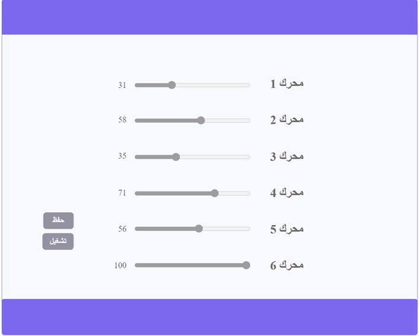

# Arm Controller Database
this is the database that stores the range slider values in it.
# Usage
engin table is dedicated to store the range slider values when the save button is clicked 

While on/off table stores "on" values when the run button is clicked, as shown in this arm controller interface

